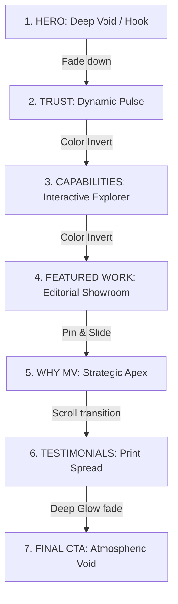

# MV Creatives Platform — Unified Master Specification & Creative Direction Reset v2.2

This specification details the revised visual direction, art direction, and interactive philosophies for the **MV Creatives** digital platform. It serves as the master design blueprint, establishing a premium, cinematic digital experience.

---

## 1. Visual Direction: Architectural Luxury, Editorial Precision, & Cinematic Technology

The visual identity of MV Creatives positions the firm as a **Premium Product Studio, Product Innovation Lab, and Digital Experience Partner**. 

```
       [ THE VISUAL SPECTRUM ]
  
   Obsidian Dark (#060608)           Chalk White (#FAFAFC)
   [Cinematic / Atmospheric]   <--->  [Tactile Lab / Blueprint]
   - Full-bleed local .webm video    - Structural thin layout borders
   - Massive geometric display type  - Monospaced technical tags
   - Soft glow refractions           - High-fidelity product details
```

### Core Design Pillars
1.  **Architectural Luxury:** Structured layouts anchored by thin, precise carbon gridlines (`1px solid var(--border)`) and a clean division of spaces that feels designed rather than templated.
2.  **Editorial Precision:** Massive typographic contrast (large headlines vs. micro technical stats) paired with generous asymmetrical margins that mimic premium print journals.
3.  **Cinematic Technology:** Layering dark obsidian viewports with real-time interactive canvas graphics, custom trailing physics, and silent, local background video loops.

---

## 2. Art Direction & Design Tokens

### 2.1 The Color Palette (Atmospheric Tech System)
We maintain the Indigo accent system as the sole brand color, paired with deep darks and warm chalk light tones.

| Token Name | Value | Context | Usage |
| :--- | :--- | :--- | :--- |
| `--bg-obsidian` | `#060608` | Dark Context | Deep black background for cinematic pages (Hero, CTA, Footer). |
| `--bg-chalk` | `#FAFAFC` | Light Context | Clean, high-contrast white for capabilities and contact forms. |
| `--bg-ebonite` | `#0E0E12` | Dark Context | Card backgrounds and structural containers in dark sections. |
| `--border-dark` | `#1C1C24` | Dark Context | Carbon-colored layout gridlines and thin borders. |
| `--border-light` | `#E8E8EF` | Light Context | Soft alabaster structural dividers. |
| `--accent-indigo` | `#5C6CFA` | Shared | Electric Indigo used exclusively for primary CTAs and interactive highlights. |
| `--accent-glow` | `rgba(92,108,250,0.12)`| Shared | Soft radial aura behind display buttons and container cards. |

### 2.2 Typography System (Editorial Architecture)
Typography remains premium and enterprise-friendly, prioritizing modern geometric displays and technical monospaced details.

*   **Display Font (Geometric display):** *Satoshi* or *Plus Jakarta Sans*. Bold weights (`700/800`), uppercase setting, tight tracking (`-0.03em`). Used for display headers.
*   **Technical Label Font (Monospace):** *JetBrains Mono*. All-caps, light weights, spaced out (`0.06em`). Used for numbers, timezone displays, project metadata tags, and step counters.
*   **Body Copy Font (Geometric sans-serif):** *Inter*. Regular weights (`400/500`), balanced line height (`1.65`). Used for long-form descriptions.

---

## 3. Homepage Visual Philosophy (The Cinematic Film Strip)

The homepage operates as a choreographed vertical scroll, shifting the mood and visual weight dynamically.



### 3.1 Hero (Deep Void & Cinematic Hook)
*   **Atmosphere:** A full-bleed, desaturated local background video loop of ambient fluid dynamics (liquid chrome / glass refractions) playing silently in the background.
*   **Hero Headline:** **"DIGITAL PRODUCTS BUILT FOR THE UNCOMPROMISING."** Set in massive Satoshi Display, uppercase, with tight tracking. A memorable product-studio statement that rejects consultancy-oriented phrasing.
*   **Composition:** Headline is masked and revealed via scroll-driven clip-paths.
*   **Details:** A ticking, monospaced client timezone clock using `JetBrains Mono` next to a single primary CTA button (`Start a Project`) surrounded by a soft indigo glow.

### 3.2 Trust Strip (Outcomes-First Integration)
*   **Trust Strategy:** Lead with measurable results and business outcomes *before* client names. 
*   **Composition:** A continuous, fast-scrolling horizontal text ticker.
*   **Content:** Large bold statistics form the anchor of the ticker (e.g., `+220% REVENUE GROWTH // NORTHLIGHT` and `40% OPERATIONAL REDUCTION // CAREFLOW`). Text is rendered in hollow outlines. Hovering over an outcome solidifies it in Indigo and pauses the marquee.

### 3.3 Capabilities (The Interactive Capability Explorer)
*   **Philosophy:** We reject standard cards. We create an **Interactive Capability Explorer** where the visual environment changes dynamically based on the selected service capability (Design & Branding, Websites & Ecommerce, Software & SaaS, AI & Enterprise Solutions).
*   **Composition:**
    *   Left Column: A clean, vertical index of the 4 service categories.
    *   Right Column: An interactive viewport that shifts contrast and presentation style instantly as a category is selected. 
        *   Selecting *Websites & Ecommerce* transitions the viewport to Chalk White (`#FAFAFC`) with minimal, high-end editorial product grids.
        *   Selecting *AI & Enterprise Solutions* transitions the viewport to Ebonite Dark (`#0E0E12`) with precise mathematical gridlines, performance telemetry counters, and vector neural schemas.

### 3.4 Featured Work (The Editorial Showroom)
*   **Atmosphere:** Asymmetric magazine layout. Case study cards run on alternating column lines (e.g., Column 1 pins while Column 2 scrolls twice as fast).
*   **Composition:** High-resolution product images in grayscale, shifting to crisp color on mouse hover, accompanied by large monospaced metric badges.

### 3.5 Why MV Creatives (The Strategic Apex)
*   **Atmosphere:** Return to deep obsidian. An interactive canvas displays a quiet 3D particle constellation.
*   **Composition:** Designed as a subtle, architectural drawing space. Avoids sci-fi, crypto, or futuristic glow webs. Particles act as blueprint vertices (points along geometric lines). Moving the cursor pulls vertices together to form structured product frames (e.g., a wireframe grid).

### 3.6 Testimonials (Humanized Resonance)
*   **Atmosphere:** An editorial spread. High-quality grayscale portraits of partners paired with large, italicized client quotes. 
*   **Mood:** Feels like a page from a premium design journal.

### 3.7 Final CTA (The Atmospheric Void)
*   **Visuals:** A deep-indigo radial gradient (`rgba(92,108,250,0.1)`) that pulses slowly behind a centered, minimalist headline: "BUILD WHAT OTHERS SAY IS IMPOSSIBLE."
*   **CTAs:** A clean primary button (`Start a Project`) next to a subtle link (`Hire on Contra`).

---

## 4. Portfolio Philosophy (The Creative Blueprint)

The portfolio page is treated as an interactive directory rather than a passive grid of cards.

*   **Editorial vs. Tech View Toggle:** A monospaced toggle button at the top of the page:
    *   *Editorial Mode:* Asymmetric full-bleed showcase cards with large text overlays.
    *   *Tech Mode:* A dense, fast-loading monospaced directory layout. Lists projects by Client, Stack, Year, and Metric Outcome (optimized for enterprise technical buyers).
*   **Controlled Video Reels:** **Portfolio video reels do not autoplay.**
    *   *Default State:* High-resolution static image preview.
    *   *Desktop Interaction:* Plays the video reel smoothly on cursor hover.
    *   *Mobile Interaction:* Plays the video reel on tap (touch event).
*   **Technical Headers:** Every project card has a monospaced metadata header (e.g., `[ IMPACT: +220% // CLIENT: NORTHLIGHT // STACK: NEXTJS ]`) framing the main image, reinforcing outcomes first.

---

## 5. Imagery Philosophy (Tactile Reality & Generative Art)

We ban all generic illustrations, corporate vector icons, and stock photography.

*   **Tactile Textures:** Use of macro photography capturing raw materials (brushed dark steel, frosted glass, light refractions, shifting shadow shapes).
*   **Unfiltered Grayscale:** High-contrast, desaturated photography for all people, team, and studio pictures, shifting to natural colors only on direct hover.
*   **Interactive Generative Media:** Background elements containing organic SVG lines or canvas particle grids that move with gentle inertia based on mouse hover coordinates.

---

## 6. Motion Philosophy & Scroll Choreography (Kinetic Energy)

Motion is used to guide narrative flow and focus attention, not as decorative filler.

*   **Spring Physics:** Custom cursor follower uses high-friction spring calculations, morphing from a minimal ring into an active lens that magnifies text and highlights buttons.
*   **Viewport-Locked Reveal:** Large display text lines reveal themselves using clip-path masks, sliding up vertically in sync with the user's scroll speed.
*   **Kinetic Hover Snap:** Primary button CTAs magnetize towards the cursor when it enters a `40px` radius, dragging the button slightly to create a physical, tactile connection.

---

## 7. Video Strategy (The Cinematic Backdrops)

Video serves as the emotional foundation of the platform's visual identity.

*   **Ambient Loops (Background):** Highly compressed, dark, looping video backdrops (`.mp4`/`.webm`, less than `2.5MB` each) displaying organic fluid dynamics, architectural lighting shifts, or abstract glass movements. These run silently behind text layers.
*   **Interface Reels (Thumbnails):** Short, high-fidelity screen-capture loops (5–10 seconds) embedded in case study cards, demonstrating actual software usage, micro-interactions, and visual polishing in real-time.
*   **Fade-to-Color triggers:** Video overlays start in desaturated grayscale, blending into full contrast and color on user interaction (scroll-hover).
