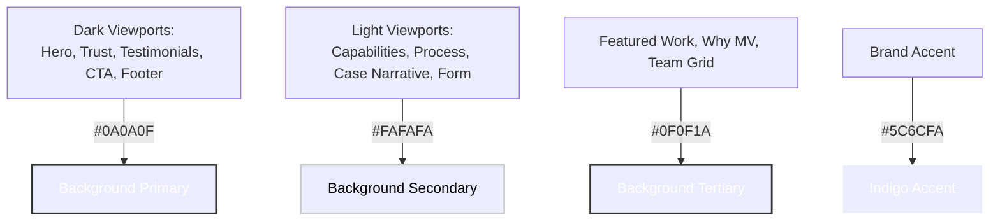
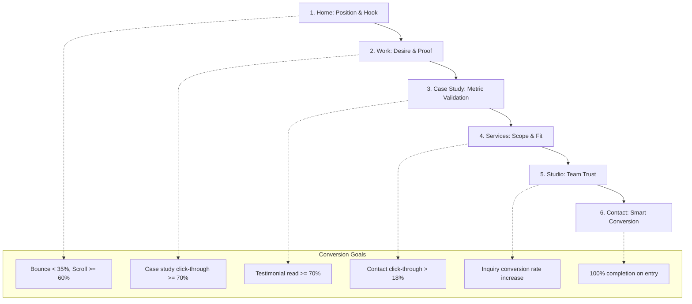

# MV Creatives Platform Production Design Specification v1.0

This document is the complete, high-fidelity visual design and frontend experience specification for the entire **MV Creatives** digital platform, encompassing the **Home, Services, Work, Studio, and Contact** pages, along with the **Case Study Framework**. It serves as the single source of truth for UI designers and frontend developers, ensuring visual unity, motion continuity, and layout responsiveness.

> [!IMPORTANT]
> *   **Insights/Blog Removal:** The Insights/Blog page has been completely removed from the navigation system and page structure for V1.
> *   **CTA System Standardization:** The CTA system consists strictly of: **Start a Project** (Primary/Accent), **View Our Work** (Secondary/Ghost), and **Hire on Contra** (Trust CTA/Text link). All references to "Book a Call", "Partner with Us", and "Discuss Your Project" are removed.
> *   **Service Architecture:** All individual services are grouped under: **Design & Branding**, **Websites & Ecommerce**, **Software & SaaS**, and **AI & Enterprise Solutions**.
> *   **Logotype:** MV Creatives uses a premium text-based logotype `"MV CREATIVES"` set in Plus Jakarta Sans 24px/700, color `#F0F0F8`. No graphic icon/mark is used in the navigation or footer.
> *   **Real Content Only:** All client references, metrics, testimonials, and portfolio entries utilize real MV Creatives content: **Northlight**, **CareFlow**, **SafeHealth**, and **ApexRetail**.

---

## 1. Design System Tokens & Theme Matrix

The platform operates on **Direction C (Hybrid System)**, which alternates between immersive true dark viewports for manifesto statements and high-contrast light viewports for readability of data-rich elements.

### 1.1 Color Tokens

| Token Name | Value | Context | Usage Description |
| :--- | :--- | :--- | :--- |
| `--bg-hero` | `#0A0A0F` | Dark Context | Deep black background for Hero viewports, testimonials, final CTA sections, and the footer. |
| `--bg-light` | `#FAFAFA` | Light Context | Warm, anti-glare off-white background for capabilities, timeline charts, and forms. |
| `--bg-dark-anchor` | `#0F0F1A` | Dark Context | Slightly lighter anchor dark background for portfolio grids, competitive matrices, and team blocks. |
| `--surface-dark-card`| `#1A1A28` | Dark Context | Cards, panels, and elevated surfaces in dark sections. |
| `--surface-light-card`| `#FFFFFF` | Light Context | Cards, panels, and elevated surfaces in light sections. |
| `--border-dark` | `rgba(255,255,255,0.06)` | Dark Context | Divider lines, grid borders, and panel edges in dark viewports. |
| `--border-light` | `#E2E2EC` | Light Context | Divider lines and borders in light viewports. |
| `--text-primary-dark` | `#F0F0F8` | Dark Context | Headings, titles, and body copy on dark backgrounds. |
| `--text-primary-light`| `#0A0A0F` | Light Context | Headings, titles, and body copy on light backgrounds. |
| `--text-secondary` | `#8888A4` | Shared | Secondary text, captions, descriptions, and labels. |
| `--accent-primary` | `#5C6CFA` | Shared | Brand primary CTA fill, hyperlinks, markers. Electric Indigo. |
| `--accent-hover` | `#7B88FF` | Shared | Brightened hover state for accent elements in dark contexts. |
| `--accent-pressed` | `#4A5AE0` | Shared | Darkened active state for accent elements in light contexts. |
| `--accent-glow` | `rgba(92,108,250,0.12)`| Shared | Ambient backdrop glow behind primary buttons and interactive nodes. |

---

### 1.2 Typography Stack & Scaling (Pairing A)

*   **Primary Display Stack (Headers):** `Plus Jakarta Sans, system-ui, -apple-system, sans-serif` (weights: `600`, `700`, `800`).
*   **Body/UI Stack (Interface/Text):** `Inter, system-ui, -apple-system, sans-serif` (weights: `400`, `600`, `700`).
*   **Monospace Stack (Data/Metrics):** `JetBrains Mono, Courier New, monospace` (weight: `400`).

| Scale Token | Font | Mobile (390px) | Tablet (768px) | Desktop (1440px) | Weight | Line Height | Letter Spacing |
| :--- | :--- | :--- | :--- | :--- | :--- | :--- | :--- |
| `display` | Plus Jakarta Sans | `48px` | `72px` | `96px` | `700` | `0.95` | `-2px` |
| `h1` | Plus Jakarta Sans | `36px` | `56px` | `64px` | `700` | `1.0` | `-1.5px` |
| `h2` | Plus Jakarta Sans | `32px` | `40px` | `48px` | `600` | `1.1` | `-1px` |
| `h3` | Plus Jakarta Sans | `24px` | `28px` | `32px` | `600` | `1.2` | `-0.5px` |
| `h4` | Plus Jakarta Sans | `20px` | `22px` | `24px` | `500` | `1.3` | `0px` |
| `h5` | Inter | `16px` | `18px` | `18px` | `600` | `1.4` | `0.5px` |
| `h6-label` | Inter | `11px` | `12px` | `12px` | `700` | `1.5` | `1.5px` (ALL CAPS) |
| `body-large` | Inter | `18px` | `20px` | `20px` | `400` | `1.7` | `0.2px` |
| `body-regular`| Inter | `15px` | `16px` | `16px` | `400` | `1.7` | `0.15px` |
| `body-small` | Inter | `13px` | `14px` | `14px` | `400` | `1.65` | `0.1px` |
| `caption` | Inter | `11px` | `12px` | `12px` | `400` | `1.6` | `0.1px` |
| `metric` | Plus Jakarta Sans | `56px` | `72px` | `80px` | `700` | `1.0` | `-3px` |

> [!TIP]
> Line length for content copy must never exceed `65` characters per line (approx. `700px`). No light heading weights (below `600`) are permitted.

---

### 1.3 Grid, Layout, & Spacing System

*   **Desktop (1440px+):** 12-column grid. Max content width `1280px`. Side margins: `8vw` to `10vw` (flexible). Gutters: `24px` (cards) to `32px` (asymmetric blocks).
*   **Tablet (768px - 1023px):** 4-column grid. Max content width `720px`. Side margins: `6vw`. Gutters: `24px`.
*   **Mobile (320px - 767px):** 2-column grid. Full-width container, `24px` side margins. Gutters: `16px`.
*   **Vertical Padding Scale:**
    *   *Major Page Sections:* `200px` top/bottom (desktop), `120px` (tablet), `80px` (mobile).
    *   *Standard Sections:* `120px` top/bottom (desktop), `80px` (tablet), `60px` (mobile).
    *   *Inter-Element Spacing:* `16px` (eyebrow to heading), `24px` (heading to paragraph), `32px` (text to CTA row).

---

### 1.4 Depth, Elevation, & Glassmorphism

*   **Level 0 (Flat):** Zero shadow. Muted divider borders (`1px`).
*   **Level 1 (Subtle Lift):** `box-shadow: 0 2px 8px rgba(0, 0, 0, 0.04)`. Card defaults in light contexts.
*   **Level 2 (Elevated):** `box-shadow: 0 8px 24px rgba(0, 0, 0, 0.08)`. Card hover states in light contexts.
*   **Level 4 (Glow):** `filter: drop-shadow(0 0 40px rgba(92, 108, 250, 0.12))`. Backglow on CTA regions in dark viewports.
*   **Frosted Glass Panel (Navigation):** `background: rgba(10, 10, 15, 0.92)`, `backdrop-filter: blur(12px)`, `border-bottom: 1px solid rgba(255, 255, 255, 0.06)`.

---

## 2. Global Design System Components

### 2.1 Standardized Buttons & CTA Components

*   **Primary Button (Start a Project):**
    *   *Default:* Background `#5C6CFA`, text `#F0F0F8`, font `Inter 16px/600`, padding `16px 32px`, border-radius `4px`.
    *   *Hover:* Background `#6B7AFB`, scale `1.02`, `box-shadow: 0 0 40px rgba(92, 108, 250, 0.2)`. Transition: `250ms cubic-bezier(0.16, 1, 0.3, 1)`.
    *   *Active:* Background `#4A5AE0`, scale `0.98`.
*   **Secondary Button (View Our Work):**
    *   *Default:* Background transparent, border `1px solid` (`#F0F0F8` in dark context, `#0A0A0F` in light context), text matching border, padding `16px 32px`, border-radius `4px`.
    *   *Hover:* Background `rgba(255,255,255,0.06)` (dark) or `rgba(0,0,0,0.04)` (light), scale `1.02`. Transition: `250ms ease`.
*   **Trust CTA Link (Hire on Contra):**
    *   *Default:* Text `#8888A4` (dark) or `#5C6CFA` (light), font `Inter 14px/600`, right-aligned vector arrow icon (width `12px`).
    *   *Hover:* Underline expands from `0%` to `100%` width, text goes to `#F0F0F8` (dark) or `#0A0A0F` (light), arrow translates `+4px` right.

---

### 2.2 UI Form Input Fields

*   **Input Field (Text & Dropdown):**
    *   *Default:* Background transparent, border-bottom `1px solid rgba(255,255,255,0.08)` (dark) or `#E2E2EC` (light), padding `12px 0`, text color matching context primary text.
    *   *Focus:* Border-bottom transitions to `2px solid #5C6CFA`. Label above shifts color to `#5C6CFA`.
    *   *Error:* Border-bottom transitions to `2px solid #F59E0B` (warning tone), error text fades in below.

---

### 2.3 Custom Cursor Follower (Desktop Only)

*   **Default State:** Solid circle `#5C6CFA` (diameter `8px`), opacity `30%`, centered on mouse coordinates.
*   **Hover Interactive:** Expands to `40px` targeting ring, opacity `15%`. Underline/button readable inside.
*   **Card Hover (Portfolio):** Expands to `56px` targeting ring, opacity `20%`. Bold uppercase label `"VIEW"` (JetBrains Mono, `10px`) fades in at center.
*   **Click active:** Compresses to `4px` solid dot, snapping back on release with spring ease.

---

## 3. Responsive Visual Architecture (Page by Page)

### 3.1 Global Header & Navigation

*   **Grid Layout:** Logo on Columns 1–2. Nav Items on Columns 7–10 (centered flex). Primary CTA ("Start a Project") on Columns 11–12 (right-aligned). Height: `72px`.
*   **Logotype:** Text-only `"MV CREATIVES"` set in `Plus Jakarta Sans 24px/700`, color `#F0F0F8`. No icon or mark is present.
*   **Nav Links:** Strictly contains **Home**, **Services**, **Work**, **Studio**, and **Contact** (no Insights/Blog links).
*   **Scrolled Transition:** Transitions from transparent on load to scrolled frosted glass panel after scrolling `100px`.
*   **Mobile adaptation:** Hamburger icon right-aligned. Tapping hamburger opens full-screen overlay (`#0A0A0F`, slides from right). Navigation links stack vertically at `32px` gaps, styled in `Plus Jakarta Sans 32px/600`. Primary CTA sits full-width at the bottom.

---

### 3.2 Homepage Layout & Sections

*   **Hero (Section 01):** Dark theme (`#0A0A0F`). Text spans Columns 2–8. Abstract 3D glass sculpture mockup (`./hero_abstract_3d_1782055669692.png`) on Columns 9–12. Staggered fade and slide entrance triggers.
*   **Trust Strip (Section 02):** Dark theme (`#0A0A0F`). 4 monochrome client logos (Northlight, SafeHealth, ApexRetail, CareFlow) distribute evenly on Columns 2–11. 3 metrics (Qualified Leads `+220%`, Form Friction `-40%`, Support Tickets `-42%`) span Columns 2–11 in a 3-column sub-grid, count up on scroll.
*   **Capabilities (Section 03):** Light theme (`#FAFAFA`). 4 capability group cards stack asymmetrically on Columns 2–11:
    1.  *Design & Branding:* Identity systems, brand strategy, visual guidelines, UI/UX research.
    2.  *Websites & Ecommerce:* Custom builds, platform optimization, headless CMS, performance tuning.
    3.  *Software & SaaS:* Product design, component-level design systems, frontend engineering.
    4.  *AI & Enterprise Solutions:* AI-native interfaces, database automation, intelligent integrations.
*   **Featured Work (Section 04):** Dark anchor theme (`#0F0F1A`). Asymmetric magazine layout: Card 1 (`./portfolio_northlight_1782055685953.png`) spans Columns 2–7 (height `500px`), Card 2 (`./portfolio_careflow_1782055700597.png`) spans Columns 8–12 (height `420px`, pushed `80px` down). Both display metric highlights (`+220%` leads and `-40%` friction).
*   **Process (Section 05):** Light theme (`#FAFAFA`). 4 horizontal timeline phases (Discover, Architect, Build, Evolve) on Columns 2–12 with scale-X connecting line drawing on scroll. Technical architecture map (`./process_architecture_map_1782055742786.png`) on Columns 9–12.
*   **Why MV Creatives (Section 06):** Dark anchor theme (`#0F0F1A`). 4 differentiators (Strategic Depth, Technical Rigor, AI-Native Thinking, Enterprise Scale) stack on 2x2 layout. Competitive matrix centered below showing MV positioned at apex quadrant.
*   **Case Study Highlight (Section 07):** Light theme (`#FAFAFA`). Left column (Columns 2–7) for Northlight narrative + highlighted insight card. Right column (Columns 8–12) for metric `+220%` + supporting items. MacBook platform redesign mockup (`./case_study_mockup_1782055715116.png`) full-width below.
*   **Testimonials (Section 08):** Dark theme (`#0A0A0F`). Featured quote spans Columns 2–10 with Sarah Chen circular portrait (`./sarah_chen_portrait_1782055729555.png`) below (grayscale to color hover). Secondary cards (Marcus Vance, Elena Rostova) stack in Columns 2–6 and 7–11.
*   **Final CTA (Section 09):** Dark theme (`#0A0A0F`). Copy on Columns 2–10. Primary ("Start a Project") and Secondary ("View Our Work") CTAs below. Trust signals stack at Column 2: `"Serving Clients Across US, Australia & Beyond"` + `"Hire on Contra"`.

---

### 3.12 Services Page Layout & Interactions

*   **Hero (Section 01):** Dark theme (`#0A0A0F`), 100vh height. Headline: `"Capabilities that move business forward"` (`display` size). Subheadline: `"We do not add AI to our process. We think AI-first, then design for humans."` (`body-large` size). Right visual is an abstract 3D grid render showing system nodes.
*   **Capability Groups (Section 02):** Light theme (`#FAFAFA`). 4 large cards on a 2x2 grid representing the core categories: Design & Branding, Websites & Ecommerce, Software & SaaS, and AI & Enterprise Solutions.
*   **Service Deep-Dives (Section 03):** Light theme (`#FAFAFA`). Accordion list layout:
    *   *Collapsed State:* Category title (`h4` typography) + category label (`h6-label` right) + minimal arrow icon. Bottom separator line `1px solid #E2E2EC`.
    *   *Expanded State:* Arrow rotates `180deg`. Below: description + 3-column feature list + case study link. Transition: `400ms` height auto (using `grid-template-rows: 1fr` transition).
    *   *Constraint:* Only one deep-dive card can be open at a time; expanding another collapses the current.
*   **Process Timeline (Section 04):** Dark anchor theme (`#0F0F1A`). 4-step horizontal methodology stack.
*   **Pricing Signals (Section 05):** Light theme (`#FAFAFA`). 3 cards:
    1.  *Project-Based:* `"Starting at $25K"` — fixed scope and timeline.
    2.  *Partnership:* `"Starting at $15K/month"` — retainer-based model, embedded team.
    3.  *Enterprise:* `"Custom"` — multi-phase transformations, strategic advisory.
    *   *CTA Button:* Every card features the standardized Primary CTA: `"Start a Project"`.
*   **FAQ Accordion (Section 06):** Dark theme (`#0A0A0F`). Accordion dropdowns answering scale and AI process questions, following the same interaction logic as the Deep-Dives.
*   **Final CTA (Section 07):** Dark theme (`#0A0A0F`). Reuses homepage Final CTA design (no Book a Call / Partner with Us).

---

### 3.13 Work Page Layout & Interactions

*   **Hero (Section 01):** Dark theme (`#0A0A0F`), 80vh height. Headline: `"What possible looks like"` (`h1` size). Subheadline: `"Every project starts with a business problem and ends with a measurable outcome."`. Background is a desaturated composite of real MV project screens.
*   **Sticky Filter Bar (Section 02):** Dark anchor theme (`#0F0F1A`), sticks below nav header (`top: 72px`).
    *   *Horizontal Pills:* All, Design & Branding, Websites & Ecommerce, Software & SaaS, AI & Enterprise Solutions.
    *   *Active State:* Indigo fill (`#5C6CFA`), white text.
    *   *Hover State:* Translucent border indicator (`rgba(255,255,255,0.2)`).
    *   *Filtering Animation:* Grid items fade out (`200ms`), reorder using FLIP transition, and fade in (`400ms`).
*   **Featured Projects (Section 03):** Dark anchor theme (`#0F0F1A`). Magazine-style asymmetric grid representing:
    1.  **Northlight:** Spans Columns 2–7, large mock image left, text right offset by `40px`. Metric: `+220%` Qualified Leads.
    2.  **CareFlow:** Spans Columns 6–12, mock image right bleeding to screen edge, text left. Metric: `-40%` Form Friction.
    3.  **ApexRetail:** Centered composition, desaturated card image spans Columns 3–10. Metric: `-42%` Support Tickets.
*   **Project Gallery Grid (Section 04):** Light theme (`#FAFAFA`). 3-column masonry grid (desktop) displaying additional details. Cards use white surfaces (`#FFFFFF`), `8px` corner radius, and shadow level 1.
*   **Results Strip (Section 05):** Dark theme (`#0A0A0F`). Metric strip displaying cumulative achievements from real projects only: `+220% Leads`, `-40% Friction`, `-42% Support Tickets`, and `12-WK Delivery`.
*   **Final CTA (Section 06):** Dark theme (`#0A0A0F`). Headline: `"Ready for similar results?"`. CTA links: Primary `"Start a Project"`, Secondary `"View Our Work"`.

---

### 3.14 Case Study Storytelling Framework

*   **Beat 1: The Hook:** Full-screen project cover image (`100vh`), client logo, single outcome statement (e.g., `+220% Qualified Leads` for Northlight), and context label (`FINTECH • SERIES B`). Dark overlay gradient from bottom.
*   **Beat 2: The Context:** Light theme (`#FAFAFA`). Two-column block. Left: italic client quote in large typography. Right: business challenge detail, avoiding design jargon.
*   **Beat 3: The Insight:** Accent tint background (`#EEF0FF`). Highlighted block with left indigo accent border (`3px solid #5C6CFA`, `24px` padding). Details the strategic discovery (e.g. users dropping off because value wasn't clear).
*   **Beat 4: The Approach:** Light theme (`#FAFAFA`). Horizontal scroll gallery of engineering and design artifacts (wireframes, flows, system schemas). Swipeable on mobile; snap-scrolling active.
*   **Beat 5: The Solution:** Alternating dark anchor (`#0F0F1A`) and light (`#FAFAFA`) viewports showing high-fidelity screenshots in real MacBook/iPhone contexts alongside rationale.
*   **Beat 6: The Impact:** Dark theme (`#0A0A0F`). Massive hero metric (`96px` display text) + 3-card grid of supporting data. Underneath features Sarah Chen client quote with portrait headshot.
*   **Beat 7: The Invitation:** Light theme (`#FAFAFA`). Related projects grid followed by the final CTA block linking to the Contact form.

---

### 3.15 Studio Page Layout & Leadership Focus

*   **Hero (Section 01):** Dark theme (`#0A0A0F`), 100vh. Headline: `"We are the minds behind the possible"`. Subhead: `"A team of designers, engineers, and strategists who believe AI and design are not separate disciplines."`. Visual: Grayscale desaturated leadership portrait overlay.
*   **Mission & Philosophy (Section 02-04):** Light theme (`#FAFAFA`). Text spans Columns 2–8 (`max-width: 700px`). Philosophy cards stack horizontally, lifting and adding indigo borders on hover.
*   **Approach & Why MV (Section 05-06):** Dark anchor theme (`#0F0F1A`). 4-step vertical timeline showing methodology. Reuses competitor matrix diagram.
*   **Leadership Team Grid (Section 08):** Dark anchor theme (`#0F0F1A`). Asymmetric profile grid focusing strictly on leadership team members:
    *   *Featured Leader:* Large grayscale photo left (Columns 2–6), detailed biography right (Columns 7–12).
    *   *Supporting Leaders:* 3 smaller cards. Photo + name + role.
    *   *Photo Interaction:* Images are desaturated grayscale by default. Hovering over a profile card transitions the photo to full color (`400ms`), scales it slightly (`1.05`), and reveals a bottom accent glow.
*   **Credentials & Partners (Section 09):** Dark theme (`#0A0A0F`). Grayscale logo strip of key technology credentials (logos at `50%` default opacity, transitioning to `100%` on hover).
*   **Final CTA (Section 10):** Dark theme (`#0A0A0F`). Reuses final CTA system.

---

### 3.16 Contact Page Layout & Smart Form

*   **Hero (Section 01):** Dark theme (`#0A0A0F`), 60vh height. Headline: `"Let us make your possible, actual."` (`h1` size). Subheadline: `"Start with a project brief, or a Contra contract conversation."`.
*   **Multi-Path Selector Tabs (Section 02):** Dark theme (`#0A0A0F`). 3 card tabs horizontally:
    1.  *Start a Project* (Highest intent, smart form path, pre-selected).
    2.  *View Our Work* (Redirect path to portfolio gallery).
    3.  *Hire on Contra* (Redirect path to official Contra contract).
    *   *Tab Click interaction:* Smoothly expands selected tab to reveal the associated form structure or details while other tabs compress.
*   **Smart Qualification Form (Section 03):** Light theme (`#FAFAFA`), optimized for focus. Two columns:
    *   *Left Column:* 5 fields max:
        1.  *Name* (text, required)
        2.  *Email* (email, required)
        3.  *Company* (text, optional)
        4.  *Project Type* (Select dropdown: Design & Branding / Websites & Ecommerce / Software & SaaS / AI & Enterprise Solutions / Not Sure)
        5.  *Project Brief* (textarea, 3 rows)
        *   *Submit Button:* Primary accent fill, labeled `"Send Inquiry"`.
    *   *Right Column:* Trust credentials and alternate Contra booking details:
        *   *Contra Card:* `"Hire on Contra"` box linking to official profile for freelance contract routing.
*   **Form Validation:** Inline, real-time validations. Error highlight displays a warnings border-bottom (`2px #F59E0B`). Success state fades out the form block (`300ms`) and fades in a success notification (`400ms`).

---

### 3.17 Cross-Page Conversion Strategy & Metrics

*   **Page Handoff Funnel:** Each subpage ends in a final CTA that funnels the user:
    *   *Home / Work:* Final CTAs focus on **View Our Work** and **Start a Project**.
    *   *Case Studies / Services:* Final CTAs drive directly to **Start a Project** (revealing the pre-selected Services category form on Contact).
    *   *Studio:* Final CTAs build human validation to convert trust-sensitive buyers into **Start a Project** inquiries.
*   **Performance Metrics:** Target page load time (Time to Interactive - TTI) is `< 3` seconds on a standard 4G connection. LCP `< 2.2` seconds. Cumulative Layout Shift (CLS) `= 0.0`.

---
*End of visual design and platform experience specification.*
